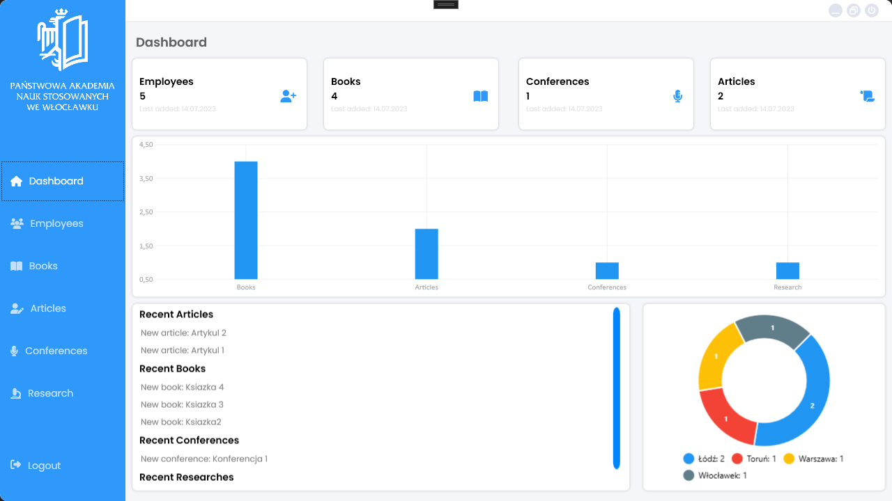
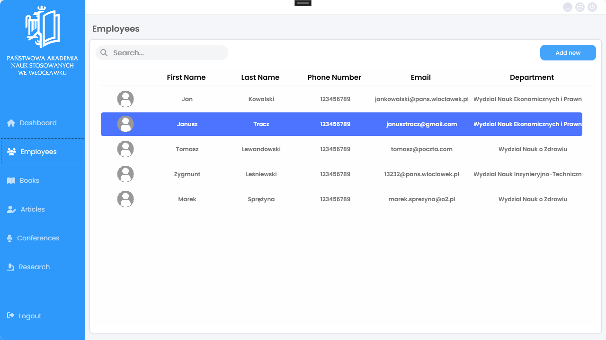
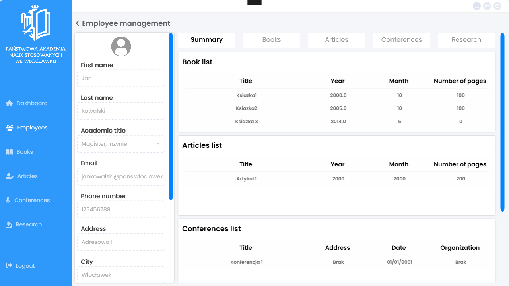
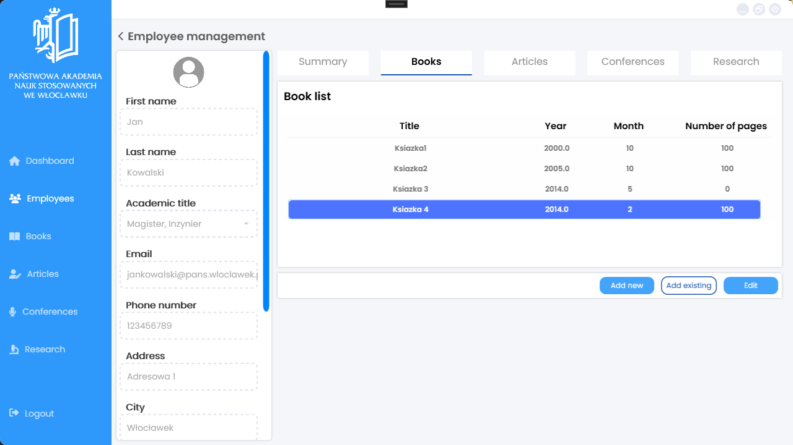
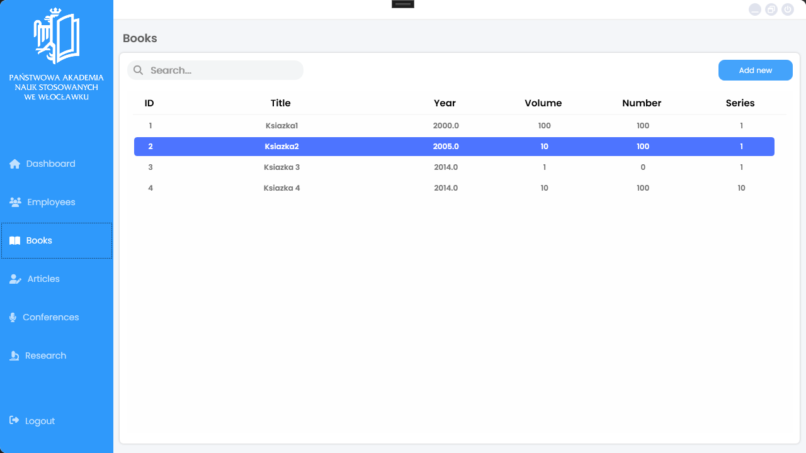
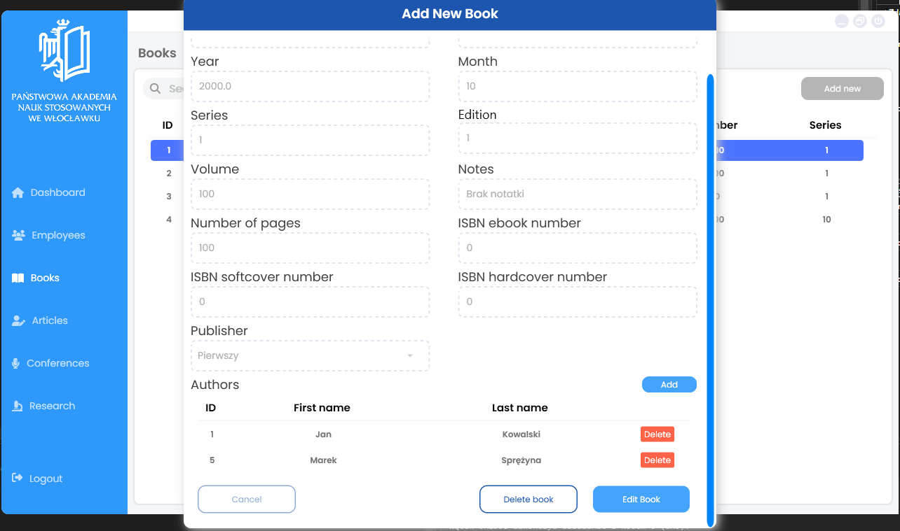
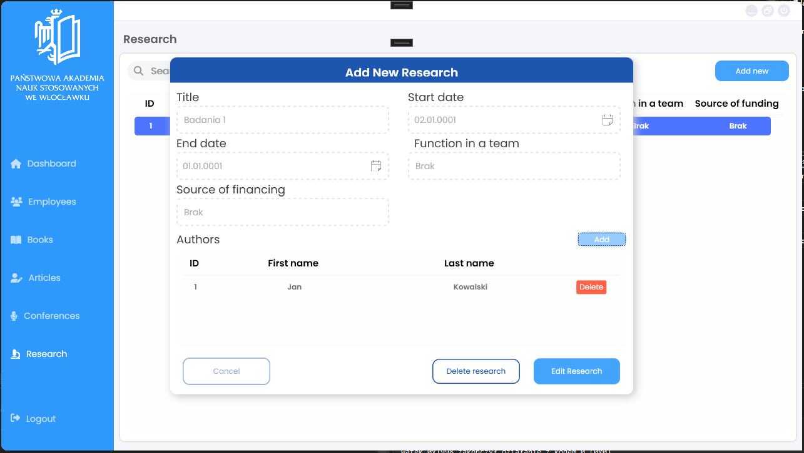
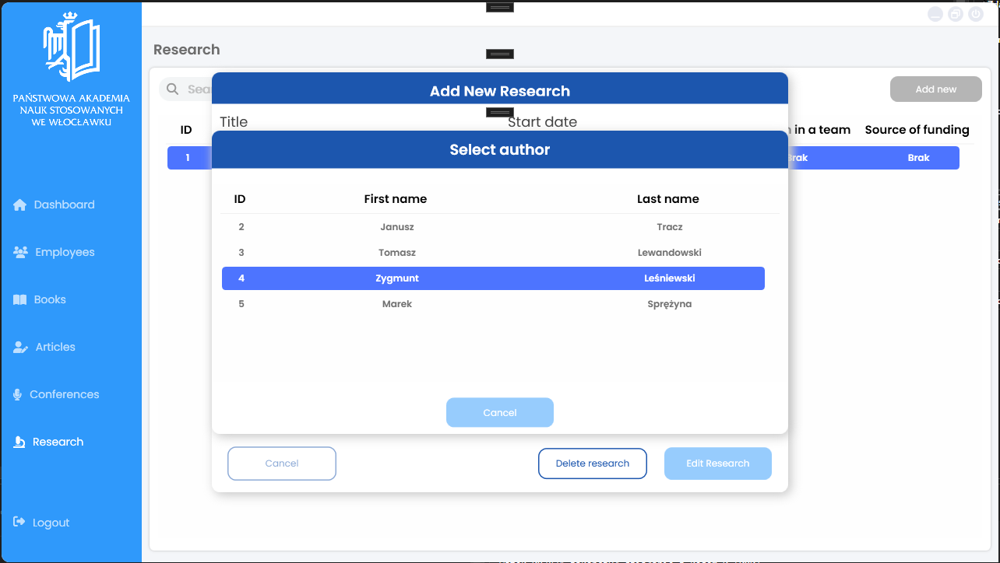

# Aplikacja do zarządzania osiągnięciami naukowymi pracowników Uczelni

Projekt został stworzony specjalnie dla Państwowej Akademii Nauk Stosowanych we Włocławku. Aplikacja umożliwia dodawanie pracowników oraz przypisywanie im różnych osiągnięć naukowych, takich jak artykuły, konferencje naukowe, książki, czy badania.

Aplikacja została napisana w .NET Framework, korzystając z WPF. Komunikuje się z serwerem za pomocą API, które zostało utworzone w ASP .NET z wykorzystaniem Entity Framework oraz bazy danych MSSQL.

Ten projekt został stworzony z myślą o uczelni i jest rezultatem udziału w kole naukowym.

Możliwości programu:

